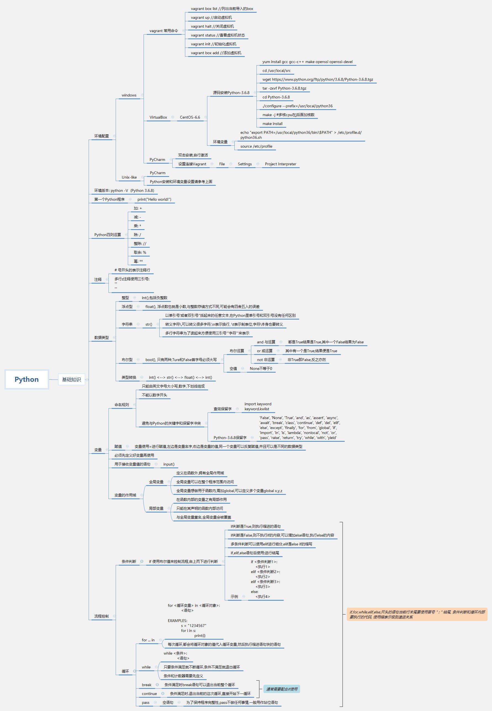

[TOC]
# 李学彬的作业
## 第一课
> 变量,数据类型,流程控制

| 文件        | 描述                                             |
| :---------- | ------------------------------------------------ |
| guessNum.py | 随机生成数字,并对其进行猜测,只有6次机会.提示大小 |
| print9x9.py | while打印99乘法表                                |

