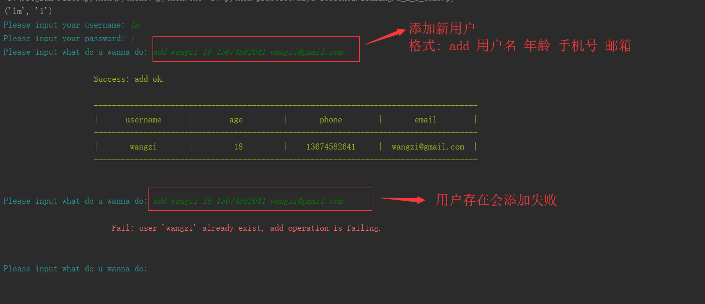
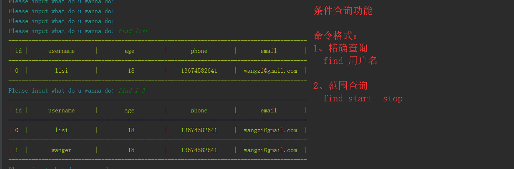
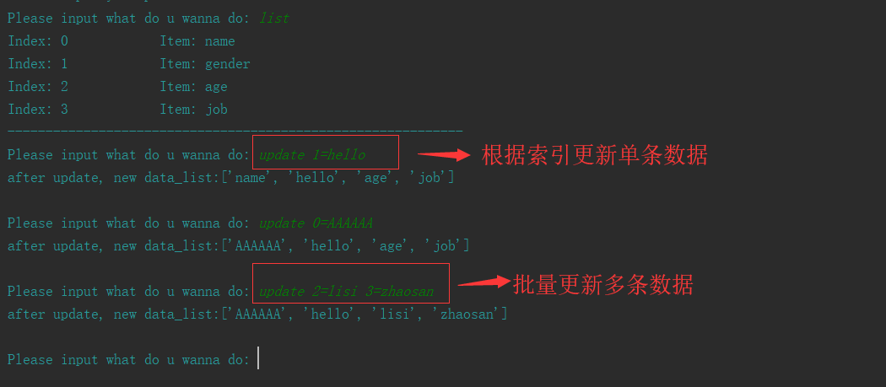
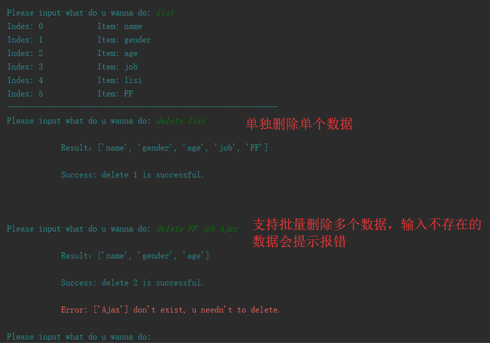

## 1. docstring文档

```
笔记连接：

文档：11 字符串.note：
http://note.youdao.com/noteshare?id=883b1061235224fdfc9f78562761810a&sub=46309330248D4273921EF94C7D5E7F08
文档：1.7 列表.note：
http://note.youdao.com/noteshare?id=73bdaa1ebfbb200e89fbf140fb58c25c&sub=DFAF015D9E8647E7BB67A057E5E7C4C2

```


## 2. 用户管理系统

```
演示执行:
python u_m_s_demo.py
```
> 增加功能演示


<br />

> 查询所有功能  
  

<br />

> 条件查询功能  


<br />

> 更新功能  


<br />

> 删除功能演示


<br />

## 3. 冒泡排序
```
演示执行：
python sort_algorithm.py

结果：
排序结果: [0, 1, 5, 21, 23, 26, 29, 34, 39, 43, 43, 45, 73, 76, 86, 87, 93, 93]
耗时: 0.0
```