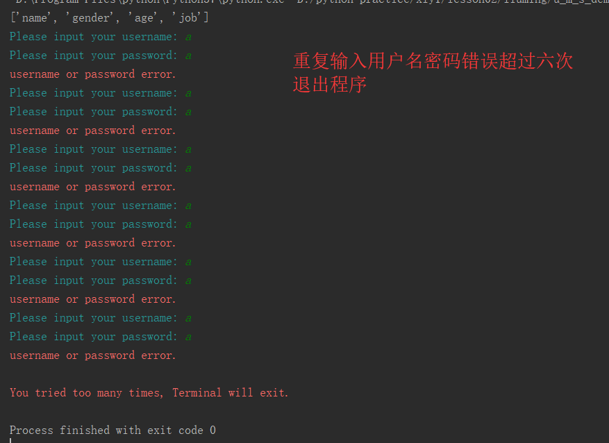
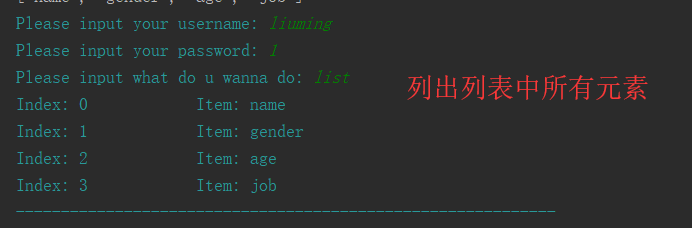
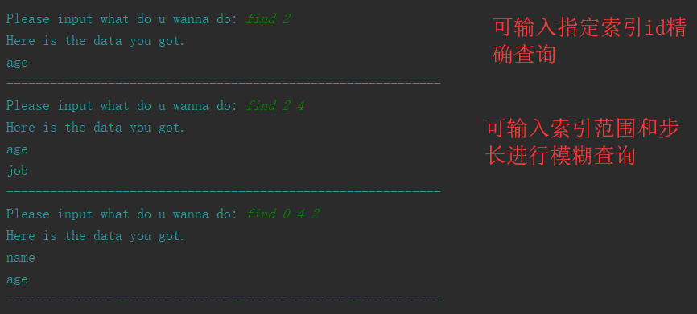
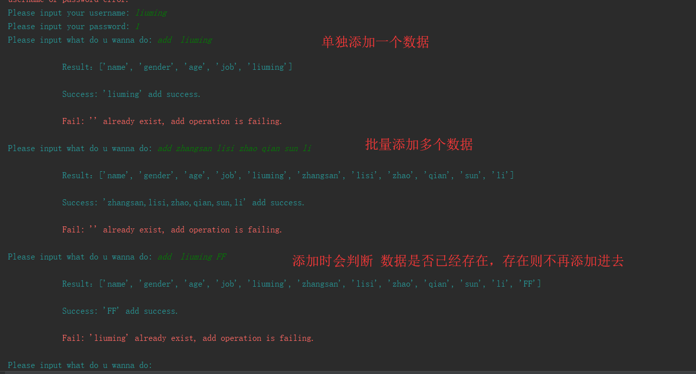

## 1. docstring文档

```
还没看到视频，所以暂未理解需求格式，暂未完成

```


## 2. 用户管理系统

```
演示执行:
python u_m_s_demo.py
```
> 登录验证功能  


<br />

> 查询所有功能  
  

<br />

> 条件查询功能  


<br />

> 更新功能  


<br />

> 删除功能演示


<br />

> 增加功能演示


<br />


## 3. 冒泡排序
```
演示执行：
python sort_algorithm.py

结果：
排序结果: [0, 1, 5, 21, 23, 26, 29, 34, 39, 43, 43, 45, 73, 76, 86, 87, 93, 93]
耗时: 0.0
```