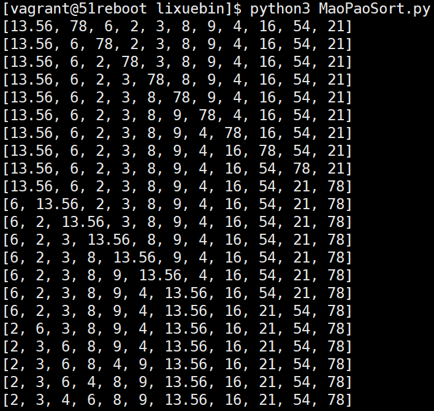
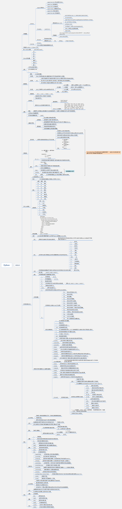

# 李学彬的作业
## 第二课

> 字符串和列表


| 文件        | 描述                                             |
| :---------- | ------------------------------------------------ |
| UserManageSystem.py | 用户管理系统,实现增删改查,增加用户重复提醒,删除更改用户不存在提醒 |
| MaoPaoSort.py | 冒泡排序的实现,目前bug,排序完成后无法判断循环次数使程序停止           |


# 方法中文注解
****

## 字符串方法注解

**注释中所有的切片方法都必须遵循左闭右开原则,`[]`中括号内为可选参数**

- str.count()
    ```
    str.count?
    Docstring:
    S.count(sub[, start[, end]]) -> int

    Return the number of non-overlapping occurrences of substring sub in
    string S[start:end].  Optional arguments start and end are
    interpreted as in slice notation.
    Type:      method_descriptor

    //中文:
        含义: 统计字符出现的次数
        返回值: 整型
        参数:
            sub: 被统计的字符
            start: 切片开始位置
            end: 切片结束位置

        语法:
            S.count("要索引的字符")
            S[开始索引位置:结束索引位置].count("字符")
            S.count(sub[, start= 0,end=len(string)])

    1. 将字符在字符串[开始索引位置:结束索引位置]中出现的次数并返回一个整型数字
    2. 可使用切片表示法,start和end是切边表示法的切片范围
    3. 可选参数指定搜索的开始结束的位置,默认是全部
    ```

- str.startswith()
    ```
    str.startswith?
    Docstring:
    S.startswith(prefix[, start[, end]]) -> bool

    Return True if S starts with the specified prefix, False otherwise.
    With optional start, test S beginning at that position.
    With optional end, stop comparing S at that position.
    prefix can also be a tuple of strings to try.
    Type:      method_descriptor

    //中文:
        含义: 判断字符串S是否以指定的字符开头
        返回值: 布尔型
        参数:
            prefix: 要查找的字符
            start: 切片开始位置
            end: 切片结束位置

        语法:
            S.startswith("用于判断开头的字符"[, start, end])


    1.判断字符是否在字符串中[start:end]的开头出现,返回一个布尔值
    2.可使用切片表示法,start和end是切边表示法的切片范围
    ```


- str.endswith()
    ```
    str.endswith?
    Docstring:
    S.endswith(suffix[, start[, end]]) -> bool

    Return True if S ends with the specified suffix, False otherwise.
    With optional start, test S beginning at that position.
    With optional end, stop comparing S at that position.
    suffix can also be a tuple of strings to try.
    Type:      method_descriptor

    //中文:
        含义: 判断字符是否以所查询的字符结尾
        返回值: 布尔型
        参数:
            suffix: 要判断的字符
            start: 切片开始位置
            end: 切片结束位置
        语法:
            S.endswith("要查询的字符"[,start,end])
    1. 判断字符是否在字符串中[start:end]的末尾出现,返回一个布尔值
    2. 可使用切片表示法,start和end是切边表示法的切片范围
    ```

- str.find()
    ```
    str.find?
    Docstring:
    S.find(sub[, start[, end]]) -> int

    Return the lowest index in S where substring sub is found,
    such that sub is contained within S[start:end].  Optional
    arguments start and end are interpreted as in slice notation.

    Return -1 on failure.
    Type:      method_descriptor

    //中文
        含义: 返回字符串中被查找字符的最低索引值(从左至右第一次出现该字符的下标索引),失败返回-1
        返回值: int
        参数:
            sub: 要查找的字符
            start: 切片开始位置
            end: 切片结束位置
        语法:
            S.find("字符")
            S[start:end].find("字符")

    1. 返回字符出现在[start:end]中从左至右第一次出现的索引值
    2. 可使用切片表示法,start和end是切边表示法的切片范围

    ```

- str.format()
    ```
    str.format
    Docstring:
    S.format(*args, **kwargs) -> str

    Return a formatted version of S, using substitutions from args and kwargs.
    The substitutions are identified by braces ('{' and '}').
    Type:      builtin_function_or_method

    //中文
        含义: 字符串格式化方法,使用format("参数")来替换字符串中的{}标识的元素
        返回值: 字符串
        参数:
            填入被格式化的变量
        语法:
            S{}.format("字符")
        1.属于内建函数或方法
    ```

- str.index()
    ```
    str.index?
    Docstring:
    S.index(sub[, start[, end]]) -> int

    Return the lowest index in S where substring sub is found,
    such that sub is contained within S[start:end].  Optional
    arguments start and end are interpreted as in slice notation.

    Raises ValueError when the substring is not found.
    Type:      method_descriptor

    //中文
        返回值: 成功int,失败ValueError
            # 当查找成功时,index()方法与find()方法相同,返回最小的索引值.
            # 区别是当使用find方法时,如果查找失败则返回-1. 使用index方法查找失败返回ValueError
        参数:
            sub: 要查找的字符
            start: 切片开始位置
            end: 切片结束位置
        语法:
            str.index(查找的元素)
            str[start:end].index(元素)

    ```

- str.isdigit()
    ```
    str.isdigit?
    Docstring:
    S.isdigit() -> bool

    Return True if all characters in S are digits
    and there is at least one character in S, False otherwise.
    Type:      method_descriptor

    //中文
        含义: 如果S中的所有字符都是数字并且至少有一个字符时,返回True,否则返回False
        返回值: 布尔型
        语法:
            str.isdigit()

    ````

- str.islower()
    ```
    str.islower?
    Docstring:
    S.islower() -> bool

    Return True if all cased characters in S are lowercase and there is
    at least one cased character in S, False otherwise.
    Type:      method_descriptor

    //中文
        含义: 如果字符串中包含区分大小写的字符并且全部为小写字符,并且字符串中至少有一个字符,返回True,否则返回False
        返回值: 布尔型
    ````

- str.isupper()
    ```
    str.isupper?
    Docstring:
    S.isupper() -> bool

    Return True if all cased characters in S are uppercase and there is
    at least one cased character in S, False otherwise.
    Type:      method_descriptor

    //中文
        含义: 如果字符串中包含区分大小写的字符并且字符都是大写,并且字符串中至少有一个字符,返回True,否则返回False
        返回值: 布尔型
    ```

- str.join()
    ```
    str.join?
    Docstring:
    S.join(iterable) -> str

    Return a string which is the concatenation of the strings in the
    iterable.  The separator between elements is S.
    Type:      method_descriptor

    //中文
        含义: 将join参数的字符串用字符串S进行分割,当join的参数只有一个不能被分割时,则会返回参数本身
        返回值: 字符串
        参数:
            iterable: 被分割的字符串
        语法:
            str.join("字符串")

    ```

- str.ljust()
    ```
    str.ljust?
    Docstring:
    S.ljust(width[, fillchar]) -> str

    Return S left-justified in a Unicode string of length width. Padding is
    done using the specified fill character (default is a space).
    Type:      method_descriptor

    //中文:
        含义: 返回一个原字符串左对齐,并使用空格填充至指定长度的新字符串。如果指定的长度小于原字符串的长度则返回原字符串。
        返回值: str
        参数:
            width: 指定补充的长度
            fillchar: 指定补充的字符,默认是空格
        语法:
            str.ljust(指定长度[, fillchar])
        1.当不指定[]中的内容时,默认空格填充至指定长度
        2.当指定长度不比字符串本身长时,返回本身

    ```
- str.lower()
    ```
    str.lower?
    Docstring:
    S.lower() -> str

    Return a copy of the string S converted to lowercase.
    Type:      method_descriptor

    //中文:
        含义: 将字符串转换为小写并输出
        返回值: str
        语法:
            str.lower()
    ```

- str.lstrip()
    ```
    str.lstrip?
    Docstring:
    S.lstrip([chars]) -> str

    Return a copy of the string S with leading whitespace removed.
    If chars is given and not None, remove characters in chars instead.
    Type:      method_descriptor

    //中文
        含义: 截取掉字符串左边的空白或指定字符或字符序列(可选多个字符进行截取)
        返回值: str
        参数:
            chars: 要截取的字符,默认为空白字符
        语法:
            str.strip([chars])
    ```

- str.replace()
    ```
    str.replace?
    Docstring:
    S.replace(old, new[, count]) -> str

    Return a copy of S with all occurrences of substring
    old replaced by new.  If the optional argument count is
    given, only the first count occurrences are replaced.
    Type:      method_descriptor

    //中文
        含义: 替换字符串中的指定的字符,可以指定不超过最大次数
        返回值: str
        参数:
            old: 被替换的字符
            new: 替换后的新字符
            count: 替换次数
        语法:
            str.replace("hello","Hello", 4)
    ```

- str.rjust()
    ```
    str.rjust?
    Docstring:
    S.rjust(width[, fillchar]) -> str

    Return S right-justified in a string of length width. Padding is
    done using the specified fill character (default is a space).
    Type:      method_descriptor

    //中文
        含义: 返回一个原字符串右对齐,并使用空格填充至指定长度的新字符串。如果指定的长度小于原字符串的长度则返回原字符串。
        返回值: str
        语法:
            str.rjust(指定长度[, fillchar])
        1.当不指定[]中的内容时,默认空格填充至指定长度
        2.当指定长度不比字符串本身长时,返回本身
    ```

- str.split()
    ```
    str.split?
    Docstring:
    S.split(sep=None, maxsplit=-1) -> list of strings

    Return a list of the words in S, using sep as the
    delimiter string.  If maxsplit is given, at most maxsplit
    splits are done. If sep is not specified or is None, any
    whitespace string is a separator and empty strings are
    removed from the result.
    Type:      method_descriptor

    //中文:
        含义: 通过指定分隔符对字符串进行切片，如果num参数指定值，则分隔 num+1 个子字符串
        返回值: list
        语法:
            str.split("分隔符"[,切分次数])
        1. 切分后.将去掉切分字符
        2. 如果不指定切分次数,默认为-1,即全部切分
    ```

- str.strip()
    ```
    str.strip?
    Docstring:
    S.strip([chars]) -> str

    Return a copy of the string S with leading and trailing
    whitespace removed.
    If chars is given and not None, remove characters in chars instead.
    Type:      method_descriptor

    //中文:
        含义: 移除字符串开头和结尾的空白或者指定字符或字符序列,默认为空白字符
        返回值: str
        参数:
            chars: 要移除的字符,默认是空白字符
        语法:
            str.strip([字符])
        1. 只能移除开头和结尾的,不能移除中间的
    ```

- str.upper()
    ```
    str.upper?
    Docstring:
    S.upper() -> str

    Return a copy of S converted to uppercase.
    Type:      method_descriptor

    //中文
        含义: 将字符串转换成大写并返回
        返回值: str
        语法:
            str.upper()

    ```

****

## 列表方法注解

**注释中所有的切片方法都必须遵循左闭右开原则,[]中括号内为可选参数**

- list.append()
    ```
    list.append?
    Docstring: L.append(object) -> None -- append object to end
    Type:      method_descriptor
    // 中文
        含义: 在列表末尾,添加新的对象
        返回值: None
        参数:
            obj: 加入列表末尾的对象
        语法:
            list.append("obj")
        实例:
            a = ["1",21,True]
            a.append(5)
            print(a)
            >>> ['1', 21, True, 5]


         1.返回值为空,但是会更改列表本身
    ```

- list.count()
    ```
    list.count?
    Docstring: L.count(value) -> integer -- return number of occurrences of value
    Type:      method_descriptor

    //中文
        含义: 统计某个元素在列表中出现的次数
        返回值: int  返回元素出现的次数
        参数:
            value:  被统计的元素
        语法:
            list.conut(obj)
        实例:
            a = ['1', 21, True, 5, 21]
            a.count(21)
            >>> 2
    ```


- list.extend()
    ```
    list.extend?
    Docstring: L.extend(iterable) -> None -- extend list by appending elements from the iterable
    Type:      method_descriptor
    //中文
        含义: 扩展列表,一次性追加另一个序列的多个值,用新列表扩展原来的列表
        参数:
            iterable: 元素列表
        返回值: None会更改列表本身
        语法:
            list.count(iterable)
        实例:
            a = ['1', 21, True, 5, 21]
            b = [3,4,5]
            a.extend(b)
            print(a)
            >>> ['1', 21, True, 5, 21, 3, 4, 5]
    ```

- list.index()
    ```
    list.index?
    Docstring:
    L.index(value, [start, [stop]]) -> integer -- return first index of value.
    Raises ValueError if the value is not present.
    Type:      method_descriptor
    //中文
        含义: 找出列表中第一次出现参数的具体值
        参数:
            value: 被查找元素
            start: 切片开始位置
            end: 切片结束位置
        返回值: int 返回找到元素的最小索引值
        语法:
            list.index(value)

        实例:
            a = ['1', 21, True, 5, 21, 3, 4, 5]
            a.index(21)
            >>> 1
    ```


- list.insert()
    ```
    list.insert?
    Docstring: L.insert(index, object) -- insert object before index
    Type:      method_descriptor

    //中文:
        含义: 将指定对象插入列表指定位置
        参数:
            index: 索引位置
            obj: 插入对象
        返回值: None
        语法:
            list.index(索引位置, 插入对象)
        实例:
            a = ['1', 21, True, 5, 21, 3, 4, 5]
            b = [3,4,5]
            a.insert(1,b)
            print(a)
            >>> ['1', [3, 4, 5], 21, True, 5, 21, 3, 4, 5]
    ```

- list.pop()
    ```
    list.pop?
    Docstring:
    L.pop([index]) -> item -- remove and return item at index (default last).
    Raises IndexError if list is empty or index is out of range.
    Type:      method_descriptor

    /中文
        含义: 按索引值删除一个列表中的元素,默认索引值是-1,删除最后一个元素,并返回被删除的元素,可以按索引值来删除指定的元素
        参数:
            index: 删除元素的索引值
        返回值: 返回被删除元素
        语法:
            list.pop(5) //删除索引值是5的元素
        实例:
            a = ['1', [3, 4, 5], 21, True, 5, 21, 3, 4, 5]
            a.pop(1)
            print(a)
            >>> ['1', 21, True, 5, 21, 3, 4, 5]
    ```

- list.remove()
    ```
    list.remove?
    Docstring:
    L.remove(value) -> None -- remove first occurrence of value.
    Raises ValueError if the value is not present.
    Type:      method_descriptor

    //中文
        含义: 按值来删除列表中的第一次匹配的元素
        参数:
            value: 被删除的元素值
        返回值: None 会更改列表本身
        语法:
            list.remove(value)
        实例:
            a = ['1', 21, True, 5, 21, 3, 4, 5]
            a.remove(5)
            print(a)
            >>> ['1', 21, True, 21, 3, 4, 5]
    ```

- list.reverse()
    ```
    list.reverse?
    Docstring: L.reverse() -- reverse *IN PLACE*
    Type:      method_descriptor

    //中文
        含义: 反转列表元素顺序
        参数: 无
        返回值: None, 会更改列表本身
        语法:
            list.revers()
        实例:
            a = ['1', 21, True, 21, 3, 4, 5]
            a.reverse()
            print(a)
            >>> [5, 4, 3, 21, True, 21, '1']
    ```


- list.sort()
    ```
    list.sort?
    Docstring: L.sort(key=None, reverse=False) -> None -- stable sort *IN PLACE*
    Type:      method_descriptor
    //中文
        含义: 对于原列表进行排序,
        参数:
            key -- 主要是用来进行比较的元素，只有一个参数，具体的函数的参数就是取自于可迭代对象中，指定可迭代对象中的一个元素来进行排序。
            reverse -- 排序规则，reverse = True 降序， reverse = False 升序（默认）
        返回值: None 会更改列表本身
        语法:
            list.sort([key=None, reverse=False])
        实例:
            1.  b = [4, 2, 5]
                b.sort()
                print(b)
                >>> [2, 4, 5]

    ```


# 用户管理:
```
 Please input your username:
51reboot
 Please input your password:
123456
  Please input your operation:
	list
 User info is None Data. Please add user info!          # 没用户数据提示空
  Please input your operation:
	add liubei 18 2345678 0@1.c
 Add liubei succ.
  Please input your operation:
	add liubei 17 123456 1@1.c
 This UserName is exist! Please change!                 # 添加用户重复.提示用户名已存在
  Please input your operation:
	add guanyu 18 234567 2@1.c
 Add guanyu succ.
  Please input your operation:
	add zhangfei 19 12345678 3@1.c
 Add zhangfei succ.
  Please input your operation:
	list

username age tel email
--------------------------------------------------

liubei 18 2345678 0@1.c
--------------------------------------------------

guanyu 18 234567 2@1.c
--------------------------------------------------

zhangfei 19 12345678 3@1.c
--------------------------------------------------
  Please input your operation:
	update liubei 17 123456 1@1.c
 Update liubei success!
  Please input your operation:
	list

username age tel email
--------------------------------------------------

liubei 17 123456 1@1.c
--------------------------------------------------

guanyu 18 234567 2@1.c
--------------------------------------------------

zhangfei 19 12345678 3@1.c
--------------------------------------------------
  Please input your operation:
	update zhaoyun 12 3456789 4@1.c
 This User is not exist. Please check!                  # update时用户不存在,提示无法update
  Please input your operation:
	list

username age tel email
--------------------------------------------------

liubei 17 123456 1@1.c
--------------------------------------------------

guanyu 18 234567 2@1.c
--------------------------------------------------

zhangfei 19 12345678 3@1.c
--------------------------------------------------
  Please input your operation:
	delete zhaoyun                            # 删除用户只需输入用户名,无需输入其他信息
 This UserName is not exist! Please reinput !           # delete时用户不存在,无法delete
  Please input your operation:
	list

username age tel email
--------------------------------------------------

liubei 17 123456 1@1.c
--------------------------------------------------

guanyu 18 234567 2@1.c
--------------------------------------------------

zhangfei 19 12345678 3@1.c
--------------------------------------------------
  Please input your operation:
	delete liubei                             # 删除用户只需输入用户名,无需其他信息
 User liubei was deleted!                               # 用户存在删除成功
  Please input your operation:
	list

username age tel email
--------------------------------------------------

guanyu 18 234567 2@1.c
--------------------------------------------------

zhangfei 19 12345678 3@1.c
--------------------------------------------------
  Please input your operation:
```

# 冒泡排序
**纯憋出来的脚本实现,目前存在bug,无法控制循环次数让流程停止**
```
L = [78, 13.56, 6, 2, 3, 8, 9, 4, 16, 54, 21]

[13.56, 78, 6, 2, 3, 8, 9, 4, 16, 54, 21]
[13.56, 6, 78, 2, 3, 8, 9, 4, 16, 54, 21]
[13.56, 6, 2, 78, 3, 8, 9, 4, 16, 54, 21]
[13.56, 6, 2, 3, 78, 8, 9, 4, 16, 54, 21]
[13.56, 6, 2, 3, 8, 78, 9, 4, 16, 54, 21]
[13.56, 6, 2, 3, 8, 9, 78, 4, 16, 54, 21]
[13.56, 6, 2, 3, 8, 9, 4, 78, 16, 54, 21]
[13.56, 6, 2, 3, 8, 9, 4, 16, 78, 54, 21]
[13.56, 6, 2, 3, 8, 9, 4, 16, 54, 78, 21]
[13.56, 6, 2, 3, 8, 9, 4, 16, 54, 21, 78]
[6, 13.56, 2, 3, 8, 9, 4, 16, 54, 21, 78]
[6, 2, 13.56, 3, 8, 9, 4, 16, 54, 21, 78]
[6, 2, 3, 13.56, 8, 9, 4, 16, 54, 21, 78]
[6, 2, 3, 8, 13.56, 9, 4, 16, 54, 21, 78]
[6, 2, 3, 8, 9, 13.56, 4, 16, 54, 21, 78]
[6, 2, 3, 8, 9, 4, 13.56, 16, 54, 21, 78]
[6, 2, 3, 8, 9, 4, 13.56, 16, 21, 54, 78]
[2, 6, 3, 8, 9, 4, 13.56, 16, 21, 54, 78]
[2, 3, 6, 8, 9, 4, 13.56, 16, 21, 54, 78]
[2, 3, 6, 8, 4, 9, 13.56, 16, 21, 54, 78]
[2, 3, 6, 4, 8, 9, 13.56, 16, 21, 54, 78]
[2, 3, 4, 6, 8, 9, 13.56, 16, 21, 54, 78]
```



