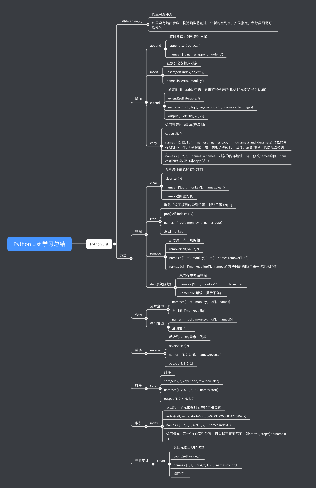

### Lesson2 home work
#### Python String 学习总结


#### Python List 学习总结


#### 用户信息管理
```
» python3 user_manager_v1.py

Please input your username: lufoeng
Please input your password: 121312
Error: username or password error, please try !!!
Please input your username: luofeng
Please input your password: 121212
Error: username or password error, please try !!!
Please input your username: luofeng
Please input your password: 123456

-----------------------------------------------------------------
| 1. 增 add     |   # 01 luof 28 132xx 18210085737@139.com      |
-----------------------------------------------------------------
| 2. 删 delete  |   # luof                                      |
-----------------------------------------------------------------
| 3. 改 update  |   # luof set age = 18                         |
-----------------------------------------------------------------
| 4. 查 list    |   # list                                      |
-----------------------------------------------------------------
| 5. 搜 find    |   # find                                      |
-----------------------------------------------------------------
| 6. 退出 exit  |   # exit                                      |
-----------------------------------------------------------------

Please input your operation: add
请输入用户信息,  格式id username age mobile email address: 01 luofeng 27 18210085737 18210085737@139.com tianjin
Add user luofeng information sucesss.
Please input your operation: add
请输入用户信息,  格式id username age mobile email address: 01 luofeng 27 18210085737 18210085737@139.com tianjin
user luofeng Already exists.
Please input your operation: add
请输入用户信息,  格式id username age mobile email address: 02 liqi 25 12121212121 12121212121@139.com hebei
Add user liqi information sucesss.
Please input your operation: list
--------------------------------------------------------------------------------
|  ID  | username | age  |     mobile      |        email         |  address   |
|  01  | luofeng  |  27  |   18210085737   | 18210085737@139.com  |  tianjin   |
|  02  |   liqi   |  25  |   12121212121   | 12121212121@139.com  |   hebei    |
--------------------------------------------------------------------------------
Please input your operation: delete
请输入要删除的用户: lsd
user lsd does not exist.
Please input your operation: delete
请输入要删除的用户: luofeng
Del user luofeng information sucesss.
Please input your operation: list
--------------------------------------------------------------------------------
|  ID  | username | age  |     mobile      |        email         |  address   |
|  02  |   liqi   |  25  |   12121212121   | 12121212121@139.com  |   hebei    |
--------------------------------------------------------------------------------
Please input your operation: update
请输入要更新的用户: sdfd
user sdfd does not exist.
Please input your operation: update
请输入要更新的用户: liqi
请输入用户信息,  格式id username age mobile email address: 02 liqi 25 12121212121 12121212121@139.com hebei
user liqi information update sucesss.
Please input your operation: list
--------------------------------------------------------------------------------
|  ID  | username | age  |     mobile      |        email         |  address   |
|  02  |   liqi   |  25  |   12121212121   | 12121212121@139.com  |   hebei    |
--------------------------------------------------------------------------------
Please input your operation: update
请输入要更新的用户: liqi
请输入用户信息,  格式id username age mobile email address: 02 liqi 25 12121212121 12121212121@139.com beijing
user liqi information update sucesss.
Please input your operation: list
--------------------------------------------------------------------------------
|  ID  | username | age  |     mobile      |        email         |  address   |
|  02  |   liqi   |  25  |   12121212121   | 12121212121@139.com  |  beijing   |
--------------------------------------------------------------------------------
Please input your operation: find
请输入要查询的用户，支持模糊查询: liq
--------------------------------------------------------------------------------
|  ID  | username | age  |     mobile      |        email         |  address   |
|  02  |   liqi   |  25  |   12121212121   | 12121212121@139.com  |  beijing   |
--------------------------------------------------------------------------------
Please input your operation: exit
```

### 冒泡排序
```
» python maopao_sort.py

[1, 2, 23, 56, 234, 232, 98, 1001, 112]
[1, 2, 23, 56, 232, 234, 98, 1001, 112]
[1, 2, 23, 56, 232, 98, 234, 1001, 112]
[1, 2, 23, 56, 232, 98, 234, 112, 1001]
[1, 2, 23, 56, 98, 232, 234, 112, 1001]
[1, 2, 23, 56, 98, 232, 112, 234, 1001]
[1, 2, 23, 56, 98, 112, 232, 234, 1001]
```
