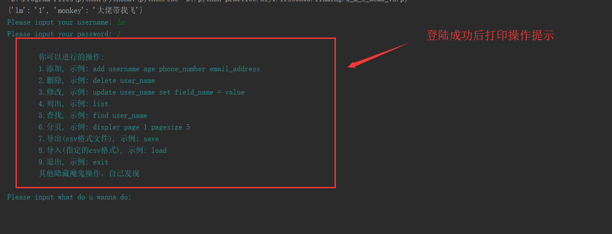
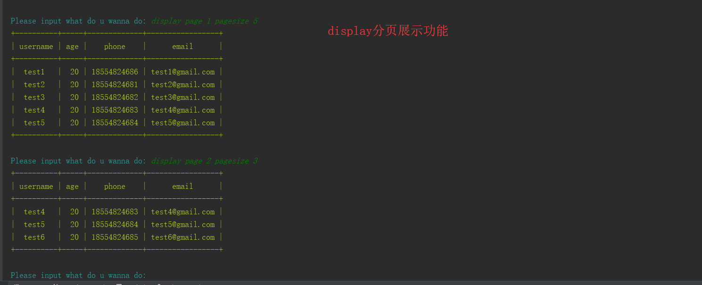
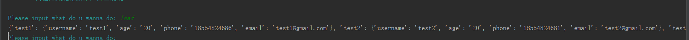
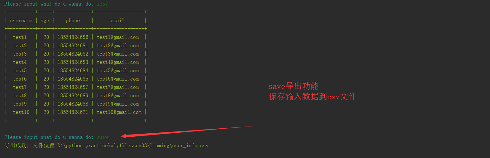
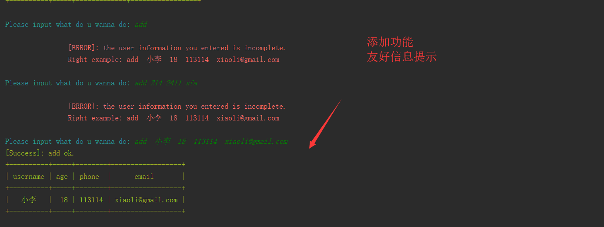
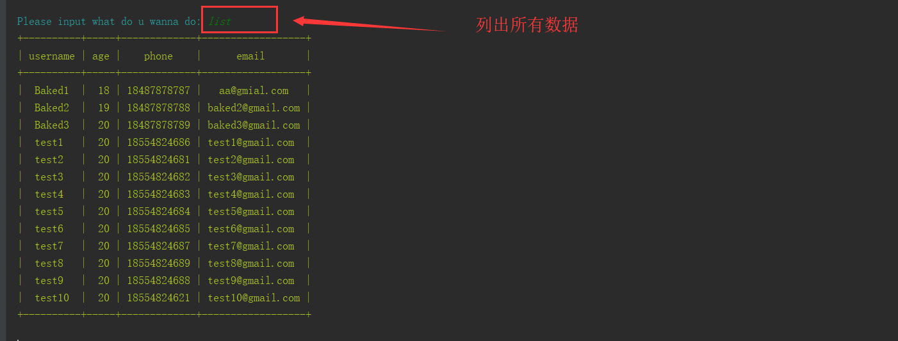

## 1: 用户管理系统 v2
```bash
1. 登录认证，用户名密码序列化到文件及从文件反序列化（json模块实现）；
2. 提示可选操作，以及示例.
3. 增删改查和搜索
    3.1 增 add           # add monkey 18 132xxx monkey@51reboot.com
    3.2 删 delete        # delete user_name
    3.3 改 update        # update user_name set field_name = value
    3.4 查 list          # list
    3.5 搜 find          # find user_name
4. 格式化输出
5. 分页输出功能
6. csv导入导出
```

## 功能演示
```
# 演示执行
python u_m_s_demo_v2.py
```
> 登陆成功，操作提示


> 分页功能演示   


<br />

> csv导入功能演示   


<br />

> csv导出功能演示  


<br />

> 增加功能演示  


<br />

> 查询所有功能  
  

<br />

> 条件查询功能  


<br />

> 更新功能  


<br />

> 删除功能演示  


<br />
