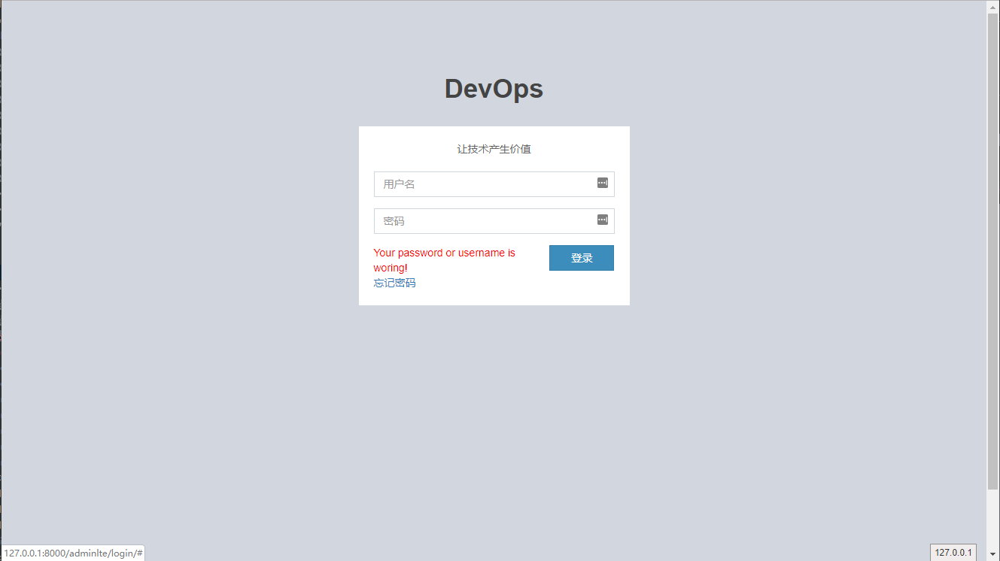
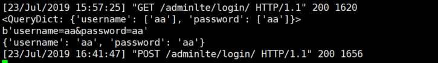
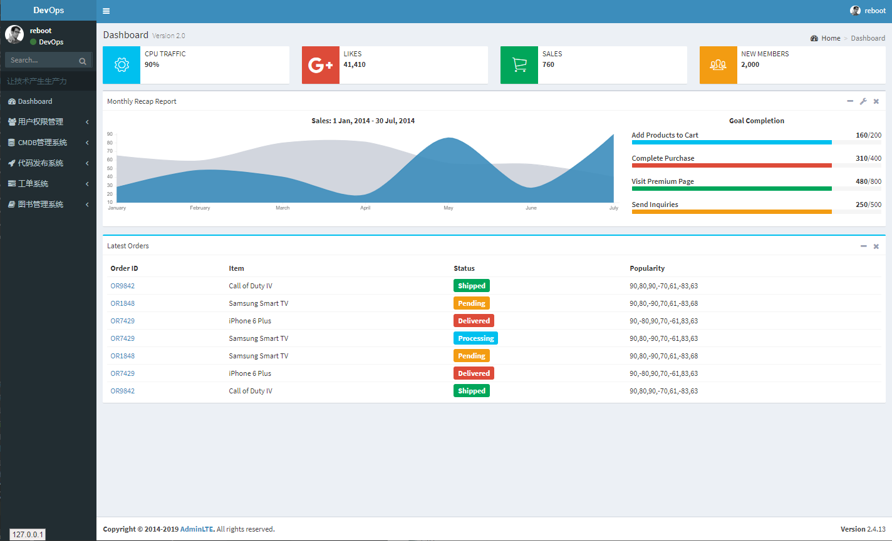
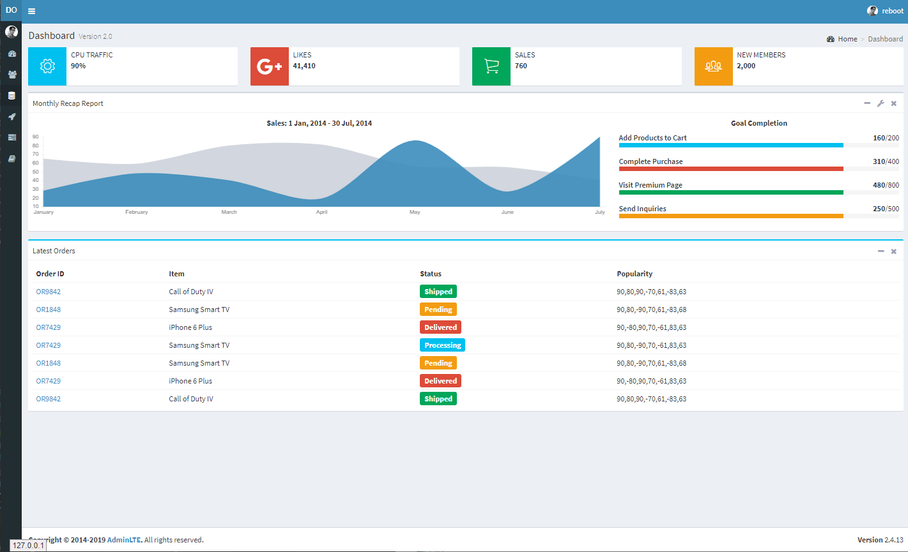

# lesson09 李学彬作业
### 1. 登录界面引入css样式，并加入登陆失败的提示

- 程序登录入口：`http://127.0.0.1:8000/adminlte/login/` 用户名:`admin` 密码:`123456`

    

- 登录失败提示

    

### 2. 登录使用post方式,登录成功后跳转首页,如果直接访问首页会跳转到登录界面
程序主页入口：`http://127.0.0.1:8000/adminlte/index/`


- post传递参数

    

- 直接访问首页跳转

    当登录成功后使用随机数当参数传到首页,首页函数获取请求参数,并判断是否与随机数相等,如果不相等则返回登录界面

    ```
    from random import randint

    RANDINT = randint(6666, 10000)
    ```

### 3. 首页更改

- 增加配置
  ```

    STATIC_URL = '/static/'

    STATICFILES_DIRS = [
        os.path.join(BASE_DIR, "static"),
        BASE_DIR+'/template/AdminLTE/bower_conponents',
        BASE_DIR+'/template/AdminLTE/dist',
    ]
    ```

- 将静态资源文件放入顶级目录的static目录下

- 更改主页文件

    

    
